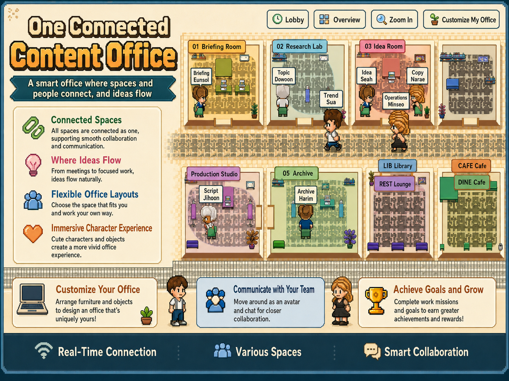
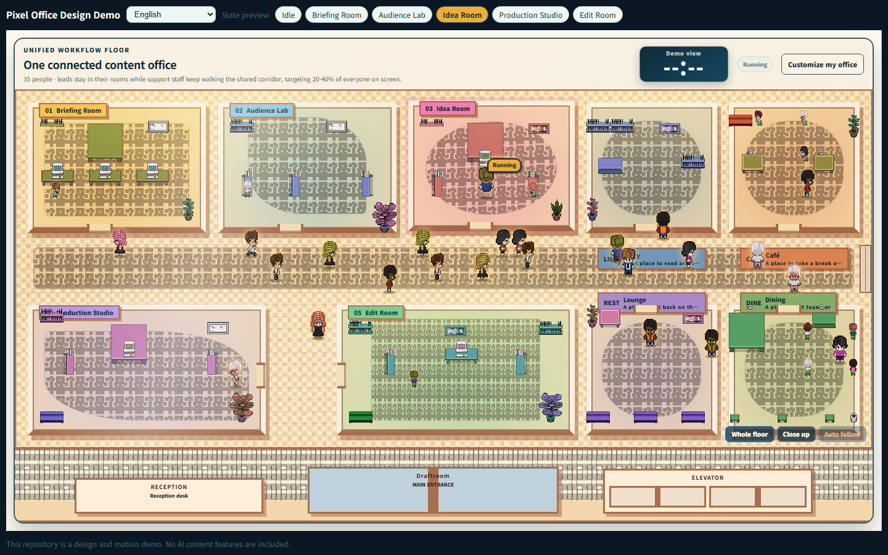
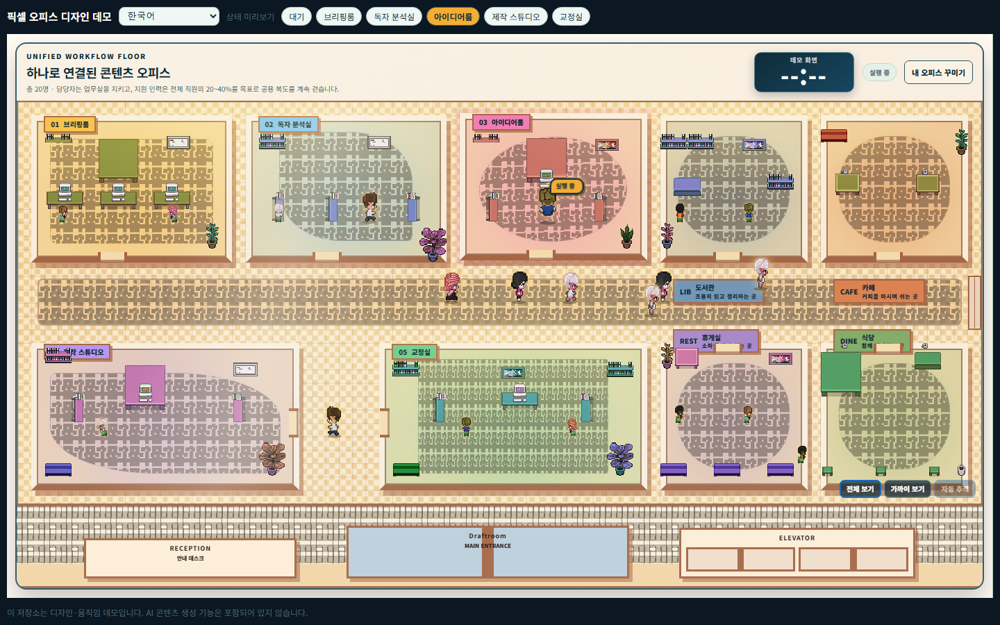
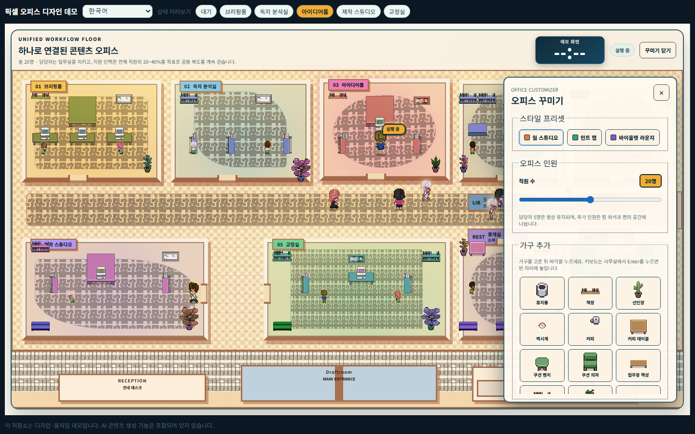

# Pixel Office Design Assets

English · [简体中文](#简体中文) · [日本語](#日本語)

A **design asset pack and motion demo** of a top-down pixel office — the office scene from the AI
content app "Pixel Company (Draftroom)". A 72×30 tile world, character movement, seating and
stroll rules, and a furniture editor, all running in the browser.



<details>
<summary>Live demo screenshots — full floor · task running state · furniture editor</summary>







</details>

## Run

```bash
npm install
npm run dev
```

Open http://localhost:5173 in your browser.

- Use the top bar to switch **language** (English, Chinese, Korean, Vietnamese, Indonesian) and
  **state preview** (idle ↔ each room running).
- Click **Customize my office** to try the furniture editor: three style presets, a headcount
  slider (5–35), and a catalog of placeable furniture.

## What's inside

| Path | Contents |
|---|---|
| `src/game/office-world.ts` | The 72×30 world: rooms, walls, doors, seats, furniture, protected walkways |
| `src/OfficeWorld.tsx` | The renderer: character movement, strolling, and the furniture editor |
| `src/company.config.ts` | 19 theme color tokens, the five rooms, and the staff roster in five languages |
| `public/characters`, `public/office-assets` | Pixel sprites and furniture art (third-party — see [THIRD-PARTY.md](THIRD-PARTY.md)) |
| `design/` | Design docs: palette, floor-plan philosophy, screen principles |
| `guide/` | How this was built with Claude Code |

## Not included

The AI content features (topic analysis, idea generation, script writing) are **not** in this
repository — they live in the finished app only. This pack is the visual world and its motion.

## Rights

- The pixel art and parts of the adapted layout/movement logic come from third-party projects and
  follow their original licenses — see [THIRD-PARTY.md](THIRD-PARTY.md) and
  [`public/third-party-notices.txt`](public/third-party-notices.txt) (authoritative).
- Everything else in this repository is published for viewing and learning. Redistribution or
  commercial use requires permission.

---

## 简体中文

自上而下像素办公室的**设计资源包与动作演示** — 来自 AI 内容制作应用「像素公司(Draftroom)」的
办公室画面。72×30 瓦片世界、角色移动、座位与漫步规则、家具编辑器，全部可在浏览器中运行。

### 运行

```bash
npm install
npm run dev
```

在浏览器中打开 http://localhost:5173。

- 顶部工具栏可切换**语言**（英语、中文、韩语、越南语、印尼语）和**状态预览**（待机 ↔ 各房间运行中）。
- 点击 **Customize my office（装扮我的办公室）** 打开家具编辑器：三种风格预设、人数滑块（5–35 人）、
  可摆放的家具目录。

### 包含内容

| 路径 | 内容 |
|---|---|
| `src/game/office-world.ts` | 72×30 世界：房间、墙、门、座位、家具、受保护通道 |
| `src/OfficeWorld.tsx` | 渲染器：角色移动、漫步、家具编辑器 |
| `src/company.config.ts` | 19 个主题色令牌、五个房间、五种语言的员工名册 |
| `public/characters`、`public/office-assets` | 像素角色与家具素材（第三方 — 见 [THIRD-PARTY.md](THIRD-PARTY.md)） |
| `design/` | 设计文档：调色板、平面布局理念、界面原则 |
| `guide/` | 如何用 Claude Code 构建本项目 |

### 不包含

AI 内容生成功能（主题分析、创意生成、脚本撰写）**不在**本仓库中，它们只存在于成品应用里。
本资源包只包含视觉世界及其动作。

### 权利说明

- 像素素材及部分改编的布局/移动逻辑来自第三方项目，遵循其原始许可证 —
  见 [THIRD-PARTY.md](THIRD-PARTY.md) 与 [`public/third-party-notices.txt`](public/third-party-notices.txt)（以后者为准）。
- 本仓库其余内容仅供浏览与学习。再分发或商业使用需获得许可。

---

## 日本語

トップダウン・ピクセルオフィスの**デザインアセットパック＆モーションデモ** — AI コンテンツ制作
アプリ「Pixel Company (Draftroom)」のオフィス画面です。72×30 タイルのワールド、キャラクターの移動、
座席と巡回のルール、家具エディターがすべてブラウザ上で動きます。

### 実行方法

```bash
npm install
npm run dev
```

ブラウザで http://localhost:5173 を開きます。

- 上部バーで**言語**（英語・中国語・韓国語・ベトナム語・インドネシア語）と**状態プレビュー**
  （待機 ↔ 各ルーム稼働中）を切り替えられます。
- **Customize my office（オフィスをカスタマイズ）** をクリックすると家具エディターを試せます：
  スタイルプリセット 3 種、人数スライダー（5〜35 人）、配置できる家具カタログ。

### 収録内容

| パス | 内容 |
|---|---|
| `src/game/office-world.ts` | 72×30 ワールド：部屋・壁・ドア・座席・家具・保護された通路 |
| `src/OfficeWorld.tsx` | レンダラー：キャラクター移動、巡回、家具エディター |
| `src/company.config.ts` | テーマカラートークン 19 種、5 つの部屋、5 言語のスタッフ名簿 |
| `public/characters`、`public/office-assets` | ピクセルスプライトと家具アート（サードパーティ — [THIRD-PARTY.md](THIRD-PARTY.md) 参照） |
| `design/` | デザインドキュメント：パレット、フロアプランの考え方、画面の原則 |
| `guide/` | Claude Code でどのように作られたか |

### 含まれないもの

AI コンテンツ機能（トピック分析・アイデア生成・台本作成）は本リポジトリには**含まれません** —
完成アプリにのみ存在します。本パックはビジュアルワールドとそのモーションです。

### 権利について

- ピクセルアートおよび一部の改変されたレイアウト／移動ロジックはサードパーティ製プロジェクトに
  由来し、それぞれのライセンスに従います — [THIRD-PARTY.md](THIRD-PARTY.md) と
  [`public/third-party-notices.txt`](public/third-party-notices.txt)（正本）を参照してください。
- その他の内容は閲覧・学習目的で公開しています。再配布や商用利用には許可が必要です。
